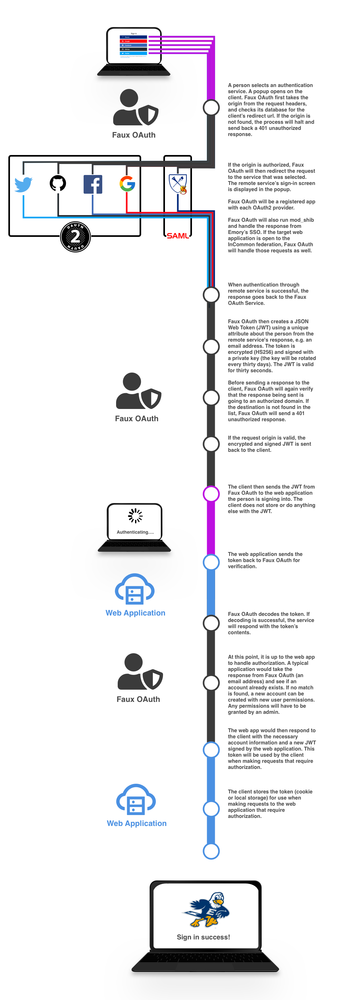

# Faux OAuth

A central OAuth broker for ECDS apps. Instead of every app registering its own
Google/GitHub OAuth credentials and managing its own accounts, apps redirect
users here, Faux OAuth handles authentication (Google, GitHub, or a local
username/password), and redirects back with a short-lived signed JWT. Client
apps never see _how_ someone authenticated — only that they did.

Apps consume this service via the
[`ecds_rails_auth_engine`](https://github.com/ecds/ecds_rails_auth_engine)
gem, which handles verifying the token against this service. New apps should
use that gem rather than re-implementing verification.

## How it works

1. A client app sends the user's browser here to start a sign-in — either an
   OmniAuth provider (`/auth/:provider`) or a local-account route (`/login`,
   `/register`), always including its own URL as `origin`.
2. Faux OAuth authenticates the user (via Google/GitHub, or a local
   email+password), looks up the `Client` whose `redirect_uri` host matches
   `origin`, and redirects back to that `redirect_uri` with an
   `access_token` query param.
3. The client app hands that token to `POST /tokens` (`params[:access_token]`)
   to verify it and read the payload.

The token is a JWT, valid for **30 seconds** — it's meant to be exchanged
once, immediately, not held onto. Its payload looks like:

```json
{
  "data": {
    "provider": "google_oauth2",
    "who": "someone@example.com",
    "name": "Some Person",
    "uid": "<sha1 digest>"
  },
  "exp": 1700000000
}
```

`provider` is `google_oauth2`, `github`, or `local`. Client apps generally
only need `who` (the email) to identify the person.

## Sign-in methods

- **Google** and **GitHub** — via OmniAuth, configured in
  `config/initializers/omniauth.rb`. Client apps link users to
  `/auth/google_oauth2?origin=<client-url>` or `/auth/github?origin=<client-url>`.
- **Local accounts** — email + password, for users without a Google or
  GitHub identity. Registration requires confirming the email address before
  the account can log in (`RegistrationsController`, `ConfirmationsController`).
  Password resets go through `PasswordsController`. All of these accept the
  same `origin` param and end up at the same token-issuing code path as the
  OmniAuth flow, so client apps genuinely can't tell the difference.

Login, registration, and password-reset attempts are rate-limited
(see the `rate_limit` calls in `SessionsController`, `RegistrationsController`,
and `PasswordsController`).

## Adding a new client

Add a client directly via the Rails console against the
production database:

```ruby
Client.create!(
  name: "Some App",                                # optional, for humans
  redirect_uri: "https://some-app.example.com/auth/callback"
)
```

`host` is derived automatically from `redirect_uri` (see `Client#set_host`),
and it's what gets matched against the `origin` param on every request — so
the `redirect_uri` you register has to resolve to the same host the client
app will actually pass as `origin`. If the client serves multiple
subdomains, each one that needs to receive tokens needs its own `Client`
row.

Once the row exists, the client app needs to:

1. Send users to `/auth/:provider?origin=<its own base URL>` (OmniAuth) or
   `/login?origin=...` / `/register?origin=...` (local accounts).
2. Handle the redirect back to its own `redirect_uri` with `?access_token=...`.
3. Verify that token via `POST /tokens` — normally through the
   `ecds_rails_auth_engine` gem rather than talking to this API directly.

## Local development

- Ruby version: see `.ruby-version` (3.3.4)
- `bundle install`
- `bin/rails db:setup` (SQLite in development/test; see `config/database.yml`)
- `bin/dev` runs the server on port 3000

Needs `config/master.key` (ask a team member, or see below) to decrypt
`config/credentials.yml.enc`, which holds `google_auth`, `github_auth`, and
`secret_key_base`. The test suite does **not** need this — it uses its own
separate, low-stakes key at `config/credentials/test.key`, which is
committed to the repo since it only decrypts fake values.

Run tests with:

```bash
bin/rails db:test:prepare && bundle exec rspec
```

## Configuration / secrets

| Variable                   | Where it's used                                    | Notes                                                                                                                                                                                                     |
| -------------------------- | -------------------------------------------------- | --------------------------------------------------------------------------------------------------------------------------------------------------------------------------------------------------------- |
| `RAILS_MASTER_KEY`         | decrypts `config/credentials.yml.enc`              | required in production; not needed for tests                                                                                                                                                              |
| `JWT_SECRET`               | signs/verifies the tokens this app issues          | required in production (`TokenService`); falls back to `secret_key_base` in dev/test. Deliberately separate from `secret_key_base` so it can be rotated without touching OAuth secrets or the DB password |
| `APP_HOST`                 | mailer link generation (confirmation/reset emails) | required in production                                                                                                                                                                                    |
| `AWS_ROLE` (GitHub secret) | OIDC role the deploy workflows assume              | see `.github/workflows/deploy.yml`                                                                                                                                                                        |

Email (account confirmation, password reset) is sent via AWS SES in
production (`from: noreply@ecds.io`), configured through the `aws-sdk-rails`
gem.

## Deployment

`build.sh` builds the image, pushes it to ECR, runs pending migrations as a
one-off ECS task (gated — a failed migration aborts before anything is
deployed), then updates the ECS service. It's invoked by
`.github/workflows/deploy.yml`, which fires after `CI` succeeds on `develop`
or `main`. `.github/workflows/deploy-check.yml` runs the same script with
`DRY_RUN=true` on every PR, to confirm the image still builds and the AWS
role still has the permissions it needs, without pushing or deploying
anything.


